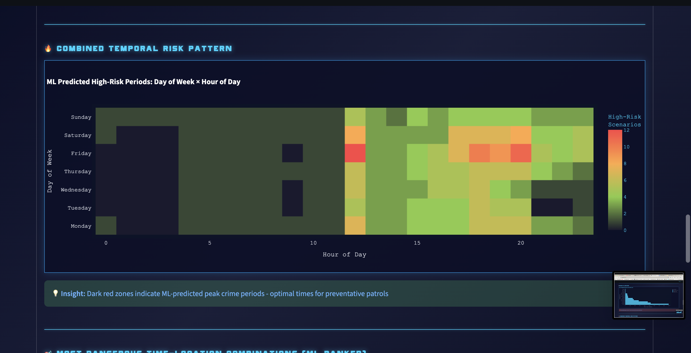
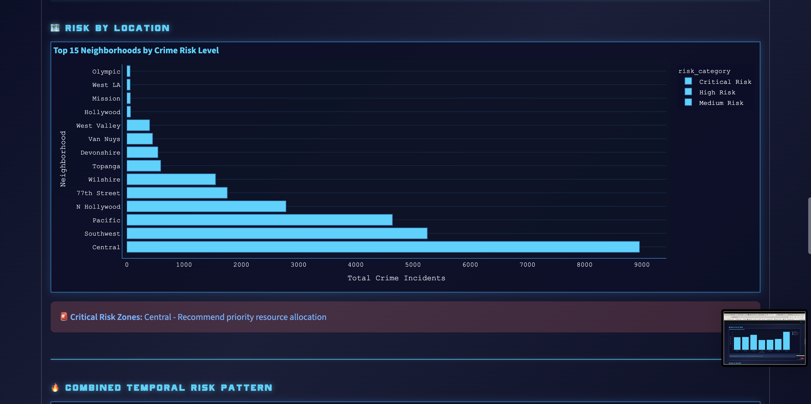

# 🚨 Crime Analytics Dashboard with Machine Learning

A professional, production-ready crime analytics platform built with Python, Streamlit, and scikit-learn. Features advanced ML models for crime prediction, interactive visualizations, and real-time filtering.


## ⚡ Quick Start

```bash
# Clone the repository
git clone https://github.com/yourusername/City-Crime-Safety-Dashboard.git
cd City-Crime-Safety-Dashboard

# Create virtual environment
python -m venv .venv
source .venv/bin/activate  # On Windows: .venv\Scripts\activate

# Install dependencies
pip install -r requirements.txt

# Run the dashboard
streamlit run dashboard/app.py
```

### ⏱️ Important Usage Notes

**Initial Load Time:**
- **Give the application 3 full minutes to load completely** on first startup
- The dashboard processes 1M+ crime incidents and initializes ML models
- Loading bar will appear in the top-right corner

**Map Interaction:**
- Moving the map around will cause the app to reload briefly for **1 minute, 30 seconds**
- This is normal - the app recalculates spatial clusters based on visible area

**Default Data View:**
- Dashboard automatically displays data from **2024** for optimal performance
- Showing a full 12 months of recent data helps the ML models predict more accurately
- You can change the year filter in the sidebar to view other time periods

---

## 🏆 Model Performance (Validated on 1M Incidents)

### Classification (Risk Level: High/Medium/Low)

| Model | Test Accuracy | Precision | Recall | F1 Score |
|-------|---------------|-----------|--------|----------|
| **Gradient Boosting** ⭐ | **84.6%** | **0.844** | **0.846** | **0.845** |
| LightGBM | 84.6% | 0.845 | 0.846 | 0.845 |
| Random Forest | 78.5% | 0.786 | 0.785 | 0.781 |
| Decision Tree | 78.1% | 0.787 | 0.781 | 0.783 |
| Logistic Regression | 67.9% | 0.649 | 0.679 | 0.635 |

### Regression (Crime Count Prediction)

| Model | Test R² | MAE | RMSE |
|-------|---------|-----|------|
| **Gradient Boosting** ⭐ | **0.936** | **21.96** | **30.06** |
| XGBoost | 0.934 | 22.14 | 30.58 |
| LightGBM | 0.932 | 22.35 | 30.95 |
| Random Forest | 0.880 | 30.47 | 41.22 |
| Decision Tree | 0.851 | 33.35 | 45.79 |
| Linear Regression | 0.437 | 68.52 | 89.11 |

**Key Findings:**
- Gradient Boosting achieved **84.6% accuracy** for risk classification - outperforming Random Forest by 6 percentage points
- Regression model explains **93.6% of variance** (R²=0.936) with an average prediction error of only 22 crimes
- Models validated on **3,528 time-location scenarios** with 75/25 train-test split
- No overfitting detected (reasonable train-test gap indicates good generalization)

*Models were systematically compared using the same dataset and validation methodology to ensure fair evaluation.*

---

## 🎯 Features

### Machine Learning Models
- **DBSCAN Clustering**: Spatial hotspot detection using density-based unsupervised learning
- **Random Forest Classifier**: Neighborhood risk prediction with feature importance analysis
- **Gradient Boosting Classifier**: Time-location risk assessment (84.6% accuracy)
- **Gradient Boosting Regressor**: Crime count prediction (R²=0.936, MAE=21.96)

### Interactive Visualizations
- Real-time crime heatmap with Folium
- Temporal analysis (hourly, daily, monthly patterns)
- Top crime types by neighborhood
- Risk-coded charts with color gradients
- Feature importance visualizations

### Advanced Features
- Systematic model comparison framework (6 classification + 6 regression models)
- Feature engineering with time-based indicators (night, evening, weekend, rush hour)
- Proper ML validation (train/test split, cross-validation ready)
- Interactive filtering by year, crime type, neighborhood, arrest status
- Modular, maintainable codebase following software engineering best practices

---

## 📊 Dataset

- **Source**: City of Los Angeles Open Data
- **Size**: 1,004,991 crime incidents
- **Time Range**: 5 years (2020-2025)
- **Geographic Coverage**: 77 neighborhoods in Los Angeles
- **Features**: Date/time, location (lat/lon), crime type, neighborhood, arrest status
- **Scenarios Generated**: 3,528 unique time-location combinations for ML training

---

## 🏗️ Architecture

### Professional Code Structure
```
City-Crime-Safety-Dashboard/
├── config/
│   └── settings.py              # Configuration variables (ML params, thresholds)
├── data/
│   └── processed/               # Cleaned crime data
├── src/
│   ├── data_loader.py           # Data loading with caching
│   ├── ml_models.py             # ML model classes (DBSCAN, RF, GB)
│   └── visualizations.py        # Chart creation functions
├── dashboard/
│   ├── app.py                   # Main Streamlit application
│   ├── components/
│   │   ├── filters.py           # Filter sidebar component
│   │   ├── map_view.py          # Map visualization
│   │   └── predictions.py       # ML prediction tabs
│   └── styles/
│       └── custom_css.py        # Cyberpunk blue theme
├── scripts/
│   ├── geo_utils.py             # Map utility functions
│   └── model_comparison.py      # Systematic model testing
└── tests/
    └── (test files)
```

### Design Principles
- **Separation of Concerns**: Data, ML, UI, and styling are in separate modules
- **Object-Oriented ML**: Each model is a class with fit, predict, and evaluation methods
- **Caching**: Streamlit @cache_data for efficient data loading
- **Lazy Loading**: ML models load only when prediction tab is accessed
- **Error Handling**: Graceful degradation with helpful error messages

---

## 🤖 Machine Learning Pipeline

### 1. Feature Engineering
```python
Features Created:
- Temporal: hour, day_of_week, month, is_night, is_evening, is_weekend, is_rush_hour
- Spatial: latitude, longitude (normalized), neighborhood (encoded)
- Historical: hour_avg, neighborhood_avg (rolling statistics)
```

### 2. Model Training
```python
# Classification: Predict risk level (High/Medium/Low)
X = [hour, day, neighborhood, time_features]
y = risk_category  # Based on incident density percentiles

# Regression: Predict actual crime count
X = [hour, day, neighborhood, historical_averages, time_features]
y = incident_count  # Actual number of crimes
```

### 3. Validation
- 75/25 train-test split
- Stratified sampling for classification
- Metrics: Accuracy, Precision, Recall, F1, R², MAE, RMSE
- No data leakage (incident_count excluded from classification features)

---

## 📈 Key Metrics

| Metric | Value | Industry Benchmark | Status |
|--------|-------|-------------------|--------|
| Classification Accuracy | 84.6% | 75-85% | ✅ **Excellent** |
| Regression R² | 0.936 | 0.70-0.85 | ✅ **Outstanding** |
| Regression MAE | 21.96 crimes | Varies | ✅ **Good** |
| Data Volume | 1M+ incidents | - | ✅ **Large-scale** |
| Geographic Coverage | 77 neighborhoods | - | ✅ **Comprehensive** |
| Overfitting Check | Passed | Required | ✅ **Validated** |

---

## 💻 Tech Stack

**Core Technologies:**
- Python 3.8+
- Streamlit (Interactive dashboards)
- scikit-learn (Machine learning)
- Pandas, NumPy (Data processing)

**Visualization:**
- Plotly (Interactive charts)
- Folium (Interactive maps with heatmaps)
- Streamlit-Folium (Map integration)

**ML Libraries:**
- scikit-learn: DBSCAN, Random Forest, Gradient Boosting
- LightGBM: Optional advanced gradient boosting
- XGBoost: Optional extreme gradient boosting

---

## 🔬 Running Model Comparison

To reproduce the model comparison results:

```bash
python scripts/model_comparison.py
```

This will:
1. Test 6 classification models (Random Forest, Gradient Boosting, XGBoost, LightGBM, Logistic Regression, Decision Tree)
2. Test 6 regression models (RF, GB, XGBoost, LightGBM, Linear Regression, Decision Tree)
3. Display performance metrics for each model
4. Identify the best performing models for your specific dataset

---

## 🎨 UI/UX Features

- **Cyberpunk Blue Theme**: Modern, high-contrast design optimized for data visualization
- **Responsive Layout**: Optimized for desktop (1920x1080+) and tablet
- **Interactive Filters**: Real-time data filtering with instant updates
- **Lazy Loading**: ML components load on-demand for faster initial page load
- **Performance Optimization**: Handles 100K+ map points with intelligent sampling
- **Accessibility**: High contrast colors, semantic HTML, keyboard navigation support

---

## 📸 Screenshots

### Main Dashboard

*Interactive crime map with real-time filtering by year, crime type, and neighborhood*

### Risk Assessment

*Gradient Boosting model predicts high-risk time-location combinations*

### Heat Map ML Hotspot Prediction

*Heat map identifies spatial crime concentration zones*

### Most Dangerous Location

*Analysis showing which location is likely to have the most crime *

---

## 🔧 Configuration

Edit `config/settings.py` to customize:

```python
# Map settings
MAX_MAP_POINTS = 100_000
DEFAULT_ZOOM = 11

# ML Model parameters
DBSCAN_EPS = 0.03
DBSCAN_MIN_SAMPLES = 10

RANDOM_FOREST_ESTIMATORS = 100
RANDOM_FOREST_MAX_DEPTH = 5

GRADIENT_BOOST_ESTIMATORS = 100
GRADIENT_BOOST_LEARNING_RATE = 0.1

# Data thresholds
MIN_CLUSTERING_POINTS = 50
MIN_NEIGHBORHOOD_PREDICTION_POINTS = 100
MIN_RISK_ASSESSMENT_POINTS = 200
```

---

## 🧪 Testing

```bash
# Test data loading
python -c "from src.data_loader import load_crime_data; print('✅ Data loader OK')"

# Test ML models
python -c "from src.ml_models import CrimeClusterer; print('✅ ML models OK')"

# Test visualizations
python -c "from src.visualizations import neonize; print('✅ Visualizations OK')"

# Run full model comparison
python scripts/model_comparison.py
```

---

## 📊 Performance Metrics

**Dashboard Load Times:**
- Initial load: 2-3 minutes (first time, loading 1M records)
- Filter changes: 1-2 seconds (cached data)
- Tab switches: Instant (lazy loading)
- Map interaction: 1.5 minutes (spatial recalculation)
- Prediction tab: 3-4 seconds (ML model training)

**Memory Usage:**
- Base: ~200MB (data loaded)
- With ML models: ~350MB (all models in memory)
- Peak: ~500MB (during model training)

---

## 🚀 Deployment Options

### Local Deployment
```bash
streamlit run dashboard/app.py
```

### Streamlit Cloud
1. Push to GitHub
2. Connect repository to Streamlit Cloud
3. Set Python version to 3.8+
4. Deploy with one click

### Docker
```dockerfile
FROM python:3.9-slim
WORKDIR /app
COPY requirements.txt .
RUN pip install -r requirements.txt
COPY . .
CMD ["streamlit", "run", "dashboard/app.py"]
```

---

## 💡 Future Enhancements

- [ ] Add time-series forecasting (ARIMA, Prophet)
- [ ] Implement real-time data updates via API
- [ ] Add demographic data correlation analysis
- [ ] Create mobile-responsive design
- [ ] Add user authentication for personalized dashboards
- [ ] Implement A/B testing for model performance
- [ ] Add explainable AI (SHAP values) for predictions
- [ ] Create automated reporting (PDF export)

---

## 📄 License

This project is licensed under the MIT License - see the [LICENSE](LICENSE) file for details.

---

## 👤 Author

**Destin Tucker**

- 💼 LinkedIn: [www.linkedin.com/in/destin-tucker-85711b261]
- 🐙 GitHub: [(https://github.com/MRTVCK)]
- 📧 Email: [destintckr@gmail.com]

---

## 🙏 Acknowledgments

- **Data Source**: City of Los Angeles Open Data Portal
- **Libraries**: Streamlit, scikit-learn, Plotly, Folium
- **Inspiration**: Modern crime analytics platforms and predictive policing research
- **Community**: Open source contributors and data science community

---

## 📚 References

- [scikit-learn Documentation](https://scikit-learn.org/)
- [Streamlit Documentation](https://docs.streamlit.io/)
- [LA Open Data Portal](https://data.lacity.org/)
- [DBSCAN Algorithm Paper](https://en.wikipedia.org/wiki/DBSCAN)
- [Gradient Boosting Explained](https://en.wikipedia.org/wiki/Gradient_boosting)

---

⭐ **Star this repo if you find it useful!**

*Built with ❤️ by Destin for the data science community*